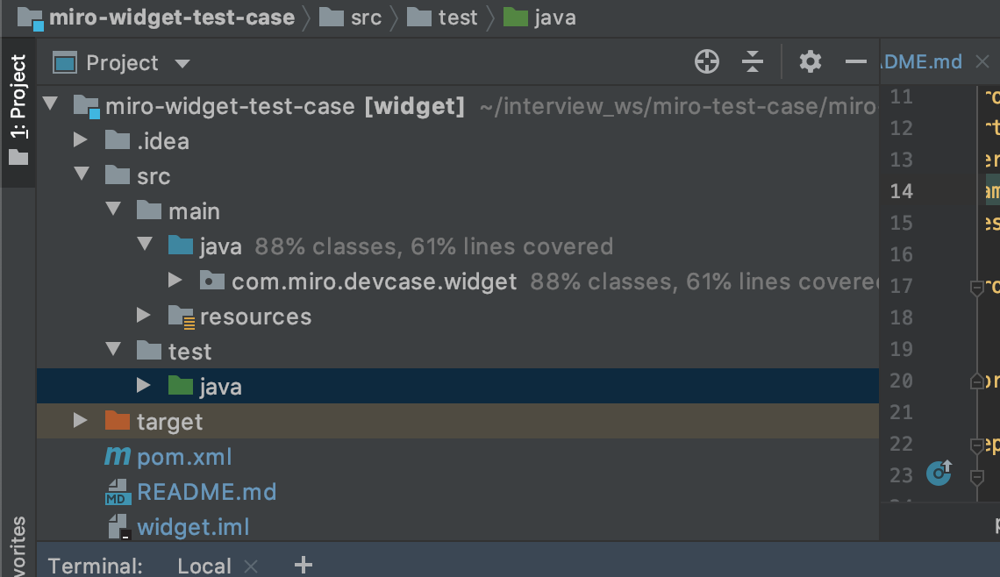

# miro-widget-app

##### Author: Marco Di Dionisio

##### Requirements:

    ● The API must conform to the REST architecture. 
    ● Do only the server side, you don’t need to do visualization. 
    ● It should be a Spring Boot application. 
    ● Maven should be used as a build tool. 
    ● Data should only be stored in memory. You can use any classes of the standard Java library to organize storage. It is not allowed to use any external repositories and databases. 
    ● At least 30% of the code should be covered by tests (preferably the presence of both unit and integration tests). 
    ● Submit sources via a public git repository. 

##### Optional point implemented
    ● Two storage implementation have been developed: one in Memory with a Java Map and one with SQL DB (H2) in memory
      The two are triggered based on the spring profile used :
        - "memory"
        - "database 
 
The app is a Spring Boot Application. It run in an embedded tomcat server listening on the port 8080
    -  http://localhost:8080/api/widgets/     
The data model is the Widget entity: 
            
            {
                "widgetId": 1,
                "width": 34,
                "height": 43,
                "zindex": 100,
                "xindex": 22,
                "yindex": 22
                "modificationDate": "2020-02-04T14:28:05.655",
            }
            
 To manage the concurrent read and write and preserve the consistency of reading I used the ReadWriteLock Java interface
            
# To build the application:
    $ mvn clean install
            
# To run the application type the command:
    $ mvn spring-boot:run -Dspring-boot.run.profiles=memory ==> It will run the application with in Memory storage profile
    
    $ mvn spring-boot:run -Dspring-boot.run.profiles=database ==> It will run the application with in H2 in memory Database storage profile
       
When running the "memory" profile a H2 database in memory is speeding up, with a management console at url:
        
        ● http://localhost:8080/h2-console
        
with username "sa" and empty password: 

         ● username: sa
         ● password: <empty>
  
  It will run the application in an embedded tomcat server listening on the port 8080

# The app expose :

    - POST /api/widgets --> it will create a new Widget passing a WidgetJson as body request and saving it in the correct order 
                            based on the Z-index 
        {
            "width": 0,
            "height": 0,
            "zindex": 2,
            "xindex": 0,
            "yindex": 0
        }
        
    - PUT /api/widgets --> it will update the Widget's attributes, except the widgetId. If the Z-index is updated
                           and there's a collision with a previous saved widget, then all the widget >= of the the colliding widget
                           are switched up on the Z-Axis by the Z_STEP defined in the code 
                           
    - DELETE /api/widgets/{id} --> Deleting a widget by its identifier. 
    
    - GET /api/widgets/{id} --> retrieve a Widget by its identifier.
    
    - GET /api/widgets/all --> retrieve all widgets ordering them by Z-Index ascending
    
# Test coverage:

    

